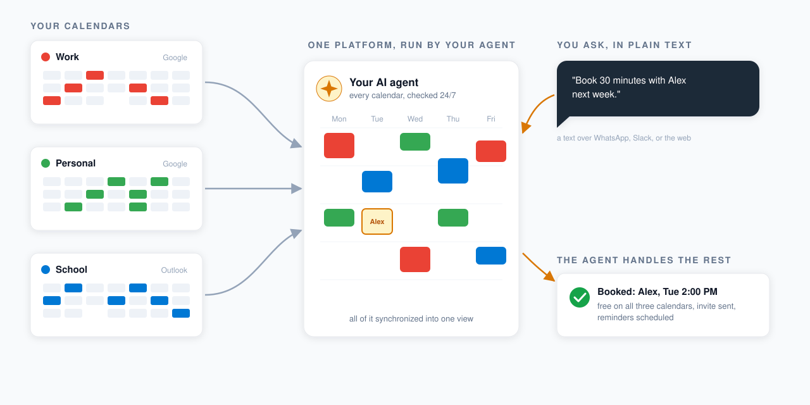
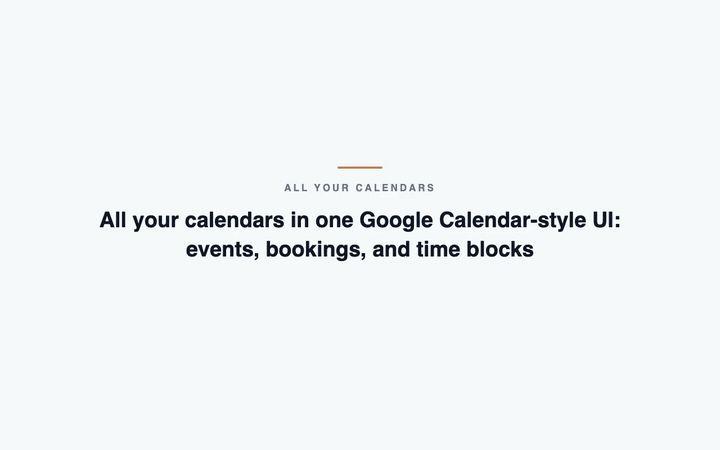
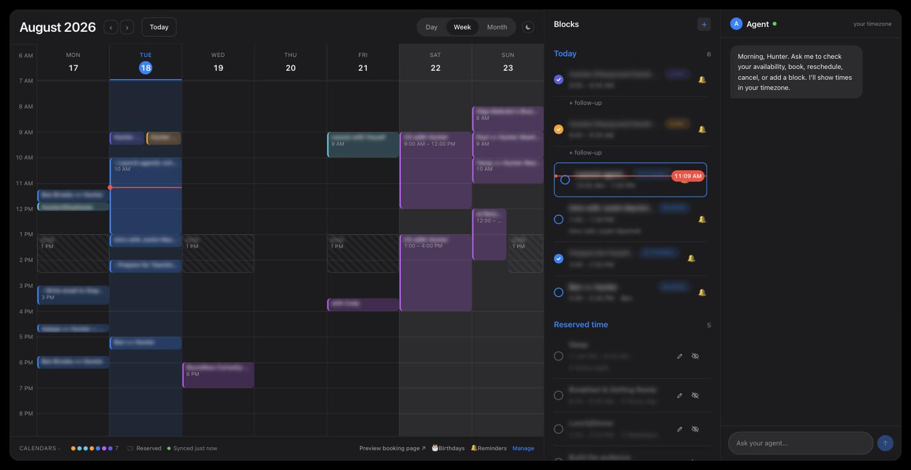
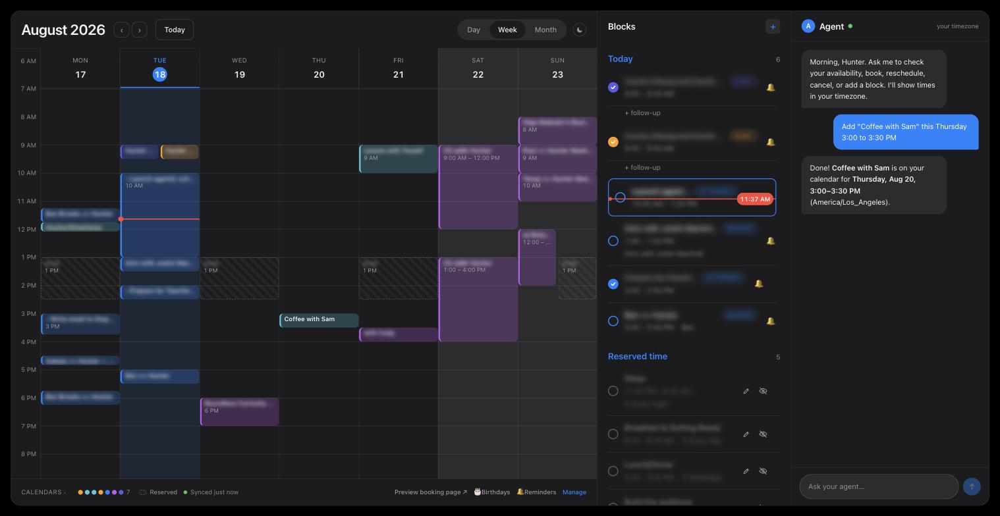
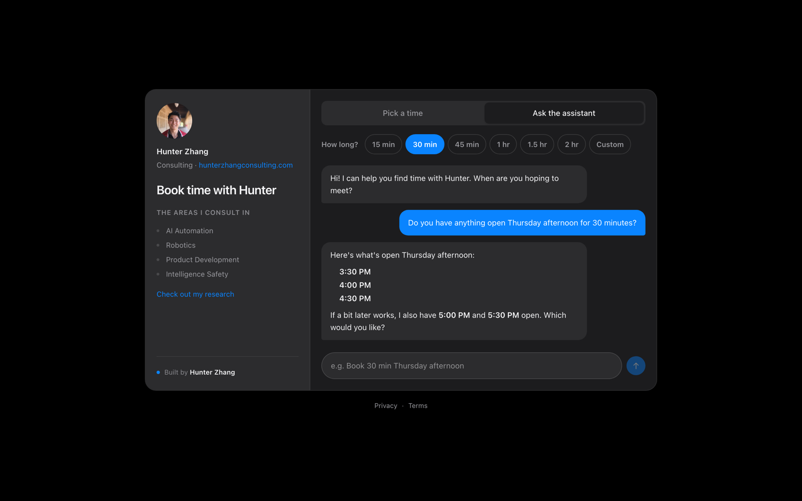
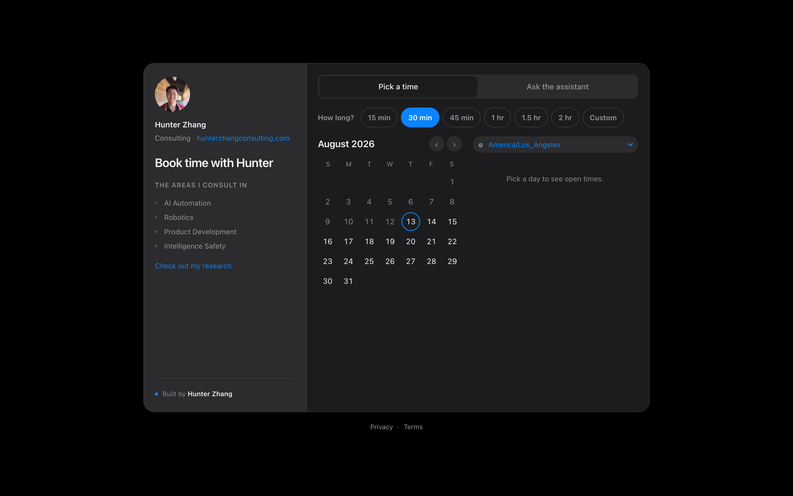
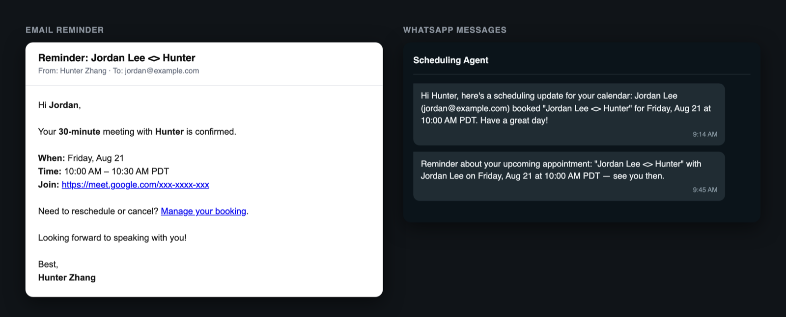
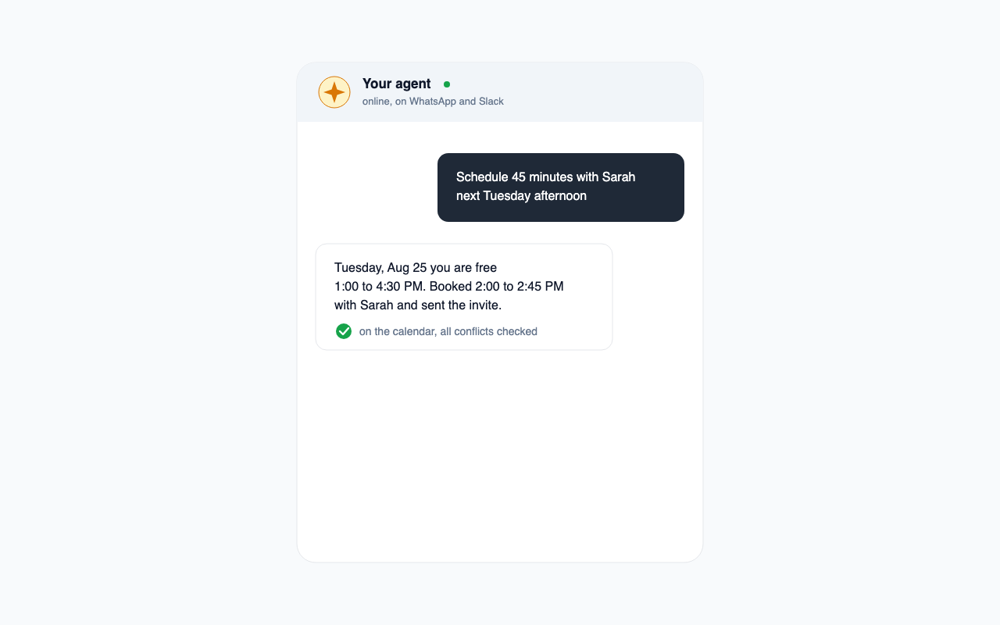
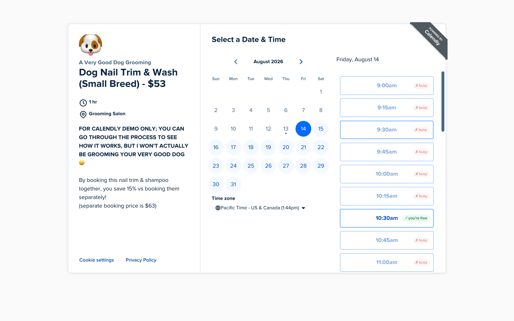
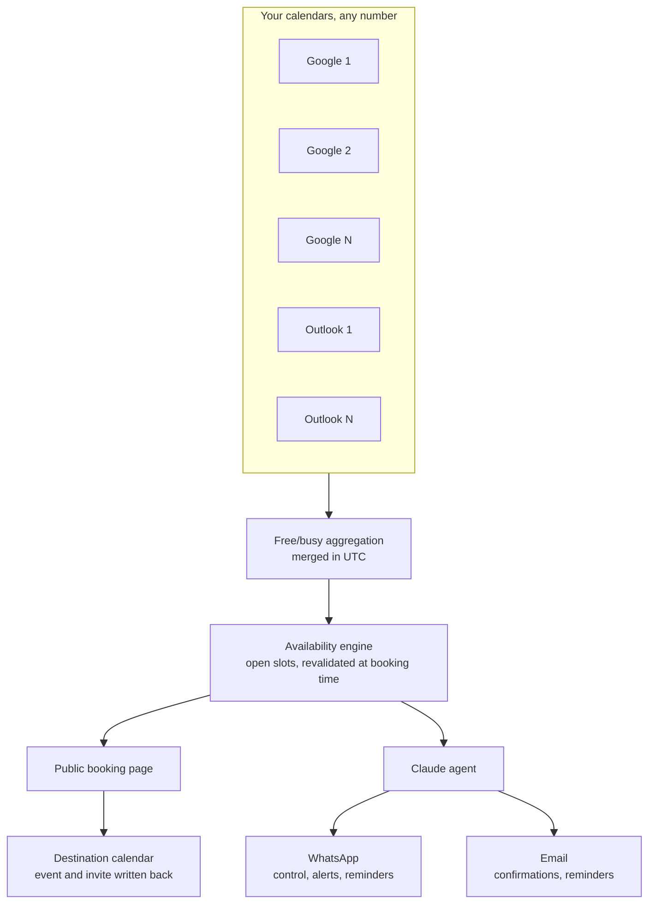

# Agentic Scheduling

**All your calendars, run by an AI agent you can text.**

When you have multiple calendars, scheduling a meeting takes real time and mental
energy: you cross-reference every calendar to find the one time that works across
all of them.

That's why I built an agent that synchronizes all your calendars, checks
availability, and schedules meetings for you 24/7, so you never have to hunt for
an open slot across your calendars again.

**Free + Calendly without the irritating setup + Google Calendar UI + a 24/7 agent,
and your data stays local.**

**[Landing page](https://agentic-scheduling-landing.vercel.app/)** ·
**[See it live: book time with me](https://bookwithhunter.com/book)**



<p>
  
  
  
  
  
</p>



*The tour. Each feature gets a one-line caption, then the visual: the calendar UI,
your agent adding an event from a text request, the visitor assistant answering
availability questions, the Calendly-style booking page, the reminders, scheduling
over WhatsApp or Slack, and the Chrome extension. Event titles are blurred for
privacy. ([full-quality video](docs/media/demo.mp4))*

## Features

Everything the demo covers, one screenshot per feature.

### All your calendars in one Google Calendar-style UI



Events, bookings, and time blocks from every connected account in one view, with the
day's agenda and your agent alongside. (Event titles blurred for privacy.)

### Agentic UI manipulation, for you



Your dashboard has an agent in the right-hand panel. Tell it the what and the when in
plain text ("Add Coffee with Sam this Thursday 3:00 to 3:30 PM", captured live above)
and the event lands on the calendar. You never have to click around the UI or send an
invite by hand again, and it never mistakes AM for PM.

### Agentic UI manipulation, for your visitors



People scheduling meetings with you don't click around either. They ask generic
questions like "When are you available on Tuesday?" and the agent replies with the
real open slots, then books the one they pick.

### A Calendly-style booking page



Visitors pick a length and a day, and only see slots that are genuinely open across
every connected calendar, revalidated at booking time so a slot that was just taken
cannot be double-booked. The same flow works on a phone:


### WhatsApp and email reminders



Attendees and the owner get reminders for upcoming meetings over email and approved
WhatsApp templates, rendered above from the real templates with sample data. A
claim/dead-letter worker retries failed sends instead of dropping them.

### Your agent in WhatsApp and Slack



Invite your agent to WhatsApp, even Slack, and schedule meetings entirely over text:
create, move, or cancel events, check availability, and get booking alerts the moment
they happen.

### Bonus: a Chrome extension for other people's Calendly pages



On someone else's Calendly page (Calendly's public demo above), every slot is badged
with your own free/busy, pulled live from your deployment, so you never book yourself
into a conflict.

## How the calendar sync works

Connect any number of Google and Outlook accounts (seven calendars, one place). The
availability engine merges their free/busy into one view, the booking page offers only
real openings, and confirmed bookings are written back to the calendar you choose.



Booking, agents, reminders, and calendar extras (personal blocks, birthdays,
follow-ups) are plain JSON APIs under `src/app/api/`, so you can reuse them from any
client.

## Upcoming

- **Agent-to-agent scheduling.** A visitor's agent and your agent negotiate a meeting
  time over a shared protocol and book the result.

## Quickstart

```bash
git clone https://github.com/hunterZh37/agentic-scheduling.git && cd agentic-scheduling
npm install
cp .env.example .env        # defaults work out of the box
docker compose up -d        # local Postgres
npx prisma migrate dev && npx prisma db seed
npm run dev                 # http://localhost:3000
```

The app boots fully on placeholder config, so you can click through the UI before
connecting anything real. When you are ready to go live,
[docs/SETUP.md](docs/SETUP.md) walks through each credential (Google, Microsoft,
Anthropic, Twilio, Resend) one at a time, in any order.

## Make it yours

All identity comes from environment variables: owner name, email, timezone, phone
numbers, and calendar credentials (see [`.env.example`](.env.example)). The one file
with brand defaults baked in is
[`src/lib/booking/publicConfig.ts`](src/lib/booking/publicConfig.ts) (practice name,
domain, consulting areas, research link). Edit it when deploying your own instance.

## Configuration

Everything is environment variables (see [`.env.example`](.env.example)). No personal
data is hardcoded.

- [docs/SETUP.md](docs/SETUP.md): credentials, mapped to each env var
- [docs/DEPLOY.md](docs/DEPLOY.md): deploying to Vercel
- [docs/SMS.md](docs/SMS.md): the WhatsApp/SMS control channel
- [docs/MORNING_BRIEF.md](docs/MORNING_BRIEF.md): the daily WhatsApp brief

## Tech stack

Next.js (App Router), React 19, and TypeScript on Vercel. Postgres via Prisma. Claude
tool-calling for the agents. Twilio for SMS/WhatsApp, Resend for email, VAPID for web
push. Luxon and rrule for time and recurrence. Vitest for tests.

## Contributing

Issues and PRs welcome. Run `npm test` and `npm run lint` before submitting.

## License

[MIT](LICENSE) © Ze Dong (Hunter) Zhang
